## Kalman Filter and Gaussian distribution
In Kalman filters the distribution is given by what we called a Gaussian and a Gaussian is a continuous function over the space of locations in the area underneath sums up to one.A Gaussian is characterized by two parameters:

    •	The mean often abbreviated with the Greek letter Mu 
    •	The width of the Gaussian often called Variance.
    

The formula of the Gaussian is presented below:

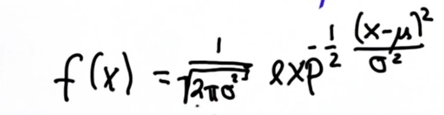

To track objects, the Kalman Filter represents our distributions by Gaussians and iterates on two main cycles. The key concepts from these cycles referenced in the below:

The first cycle is the Measurement Update.

        Requires a product
        Uses Bayes rule.
        
The second cycle is the Motion Update (Prediction).

        Involves a convolution
        Uses total probability.

### The first cycle is the Measurement Update:

I am going to talk about the measurement cycle using Gaussians: Suppose we are localizing another vehicle which has a distribution (called prior) that looks like as follow (black line) now we get a measurement that tell us something about localization of the vehicle (blue line) .

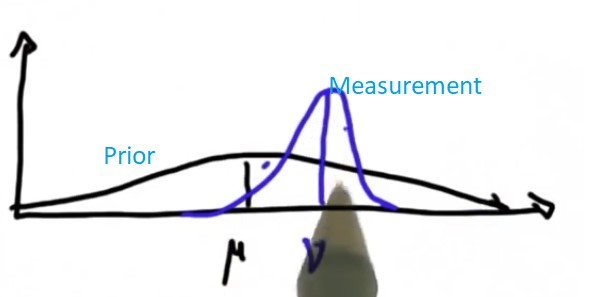

By multiplying two Gaussians (prior and Measurement), the new mean and covariance of the subsequent Gaussian (measurement update) has a smaller covariance then the measurement and prior distribution (Notice: wide covariance means we are uncertain about localization and smaller covariance means we are more certain about localization)

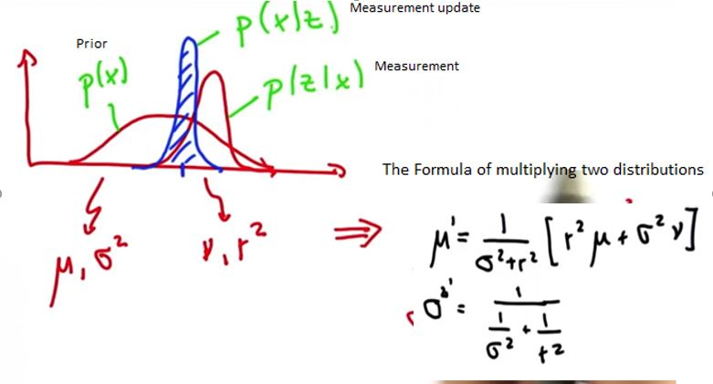

### The second cycle is the Motion Update (Prediction):
Suppose the robot lives in the life like below (blue line) and want to move to the right side with a certain distance, the motion(green line) has itself its own set of uncertainty r2 (because the motion tends to lost information ), which adds to the uncertainty of the current uncertainty σ2 and leads to a new Gaussian with high uncertainty  σ2 prime (red line):

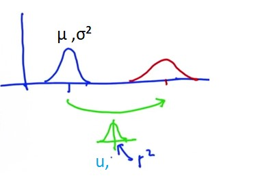

This leads to increased uncertainty over the initial uncertainty and the maths for this is really easy:

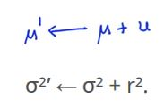

## That was a full kalman filter for 1D case but in the reality, we have many dimensions:

Suppose we have 2D state (x and y position) in our case, you might have a car that uses a Radar to detect the location of other vehicles over time (the sensor itself only sees positions and it never sees the actual velocity), what the 2D kalman filter affords you is something amazing.

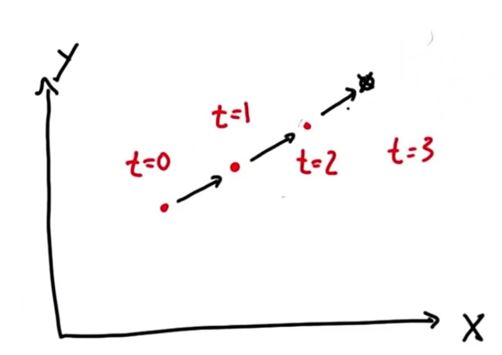

    
    
At time t=0 you observe the object of interest to be at the coordinate t=0, one time step later you see over here (t=1) and so on. A Kalman filter allows you to figure out what the velocity of the object is and uses the velocity estimate to make a good prediction about the future location of an object (the velocity is inferred from seeing multiple positions).

## To explain a kalman filter for many dimension I have to explain high dimensional Gaussian, which often called Multivariate Gaussian:

The mean is now a vector for each of the dimensions:

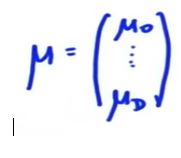

    
The variance is replace by what called a covariance and it is a matrix with D rows and D columns (if dimensionality of the estimate is D) 

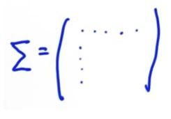

    
The formula is: 

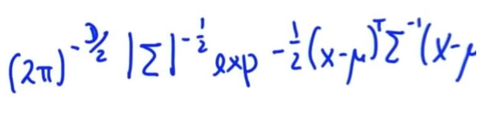

    
For two-dimensional space, a two dimensional Gaussian is defined over the space (it is possible to draw the contour lines of a Gaussian), the mean of the Gaussian is x and y pair and the covariance defined over the spread of the Gaussian. When the Gaussian is tilted as showed the uncertainty of x and y is correlated, which mean if I get information about x (point A) that make me believe that y probably sits at coordinate B.

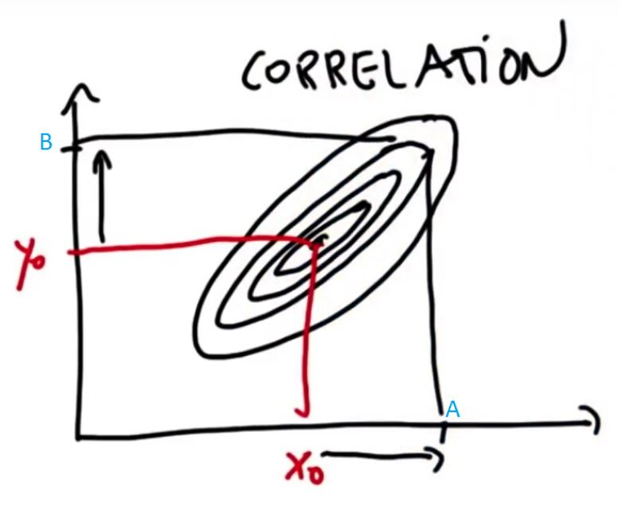

	
## Another Example that can explain a Kalman filter is presented below:
    
Suppose we have two dimensions (one for the location, which is observable from the sensor and denoted by x, and one for the velocity, which is not observable from the sensor and denoted by x dot) 

        •	you have a correlation Gaussian called prior (we know our locations is correlated to the velocity, much faster I move, the further is the location ) 
        •	you got a new measurement about the location (measurement) but you know nothing about the velocity)
By multiplying the measurement and prior Gaussians, you get a Gaussian (black line) that sits on the middle and has a good estimate what your velocity is and where your location is.

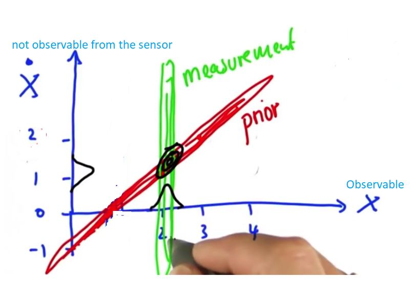

# Big Lesson:
## The Variables of a Kalman Filter 
	Often called State because they reflect the state of the physical world like position and velocity.
	They separate into two subsets:
        o	Observable (like the position)
        o	Hidden which can never directly observed (in our example velocity) and because these two thing interact (observable variables give us information about hidden information) we can estimate or inference what these hidden variables are.

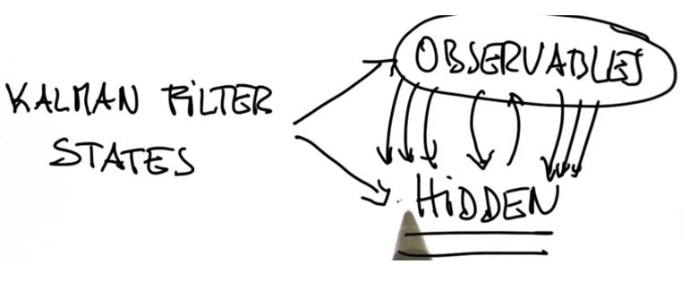

	
## Extended Kalman Filter:
### It is extended in the sense that it will be capable of handling more complex motion model and measurement models and consists of an endless loop of prediction and update state.

Imagine you are in a car equipped with sensors on the outside. The car sensors can detect objects moving around: for example, the sensors might detect a pedestrian. Let's step through the Kalman Filter algorithm using the pedestrian example. We have two sensors(a Lidar and a Radar) and the information provided be these two sensors is used to estimate the state of a moving pedestrian and this state is presented by a 4D state  vector( a x,y position and a x,y velocity).

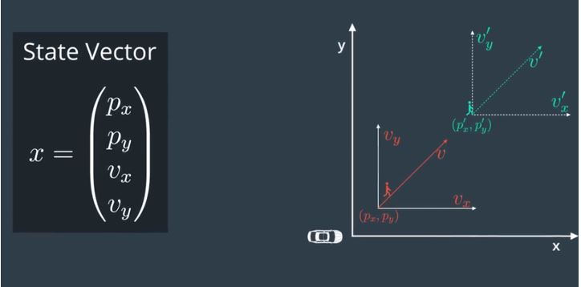

	
*	x is the mean state vector. For an extended Kalman filter, the mean state vector contains information about the object's position and velocity that you are tracking. It is called the "mean" state vector because position and velocity are represented by a Gaussian distribution with mean x.

*	P is the state covariance matrix, which contains information about the uncertainty of the object's position and velocity. 

Based on the below diagram, the filter (first measurement) will receive initial measurements of the pedestrian’s position relative to the car. These measurements will come from a radar or lidar sensor and the filter will initialize the pedestrian’s position based on the first measurement (initialize state and covariance matrices). At this point, the car will receive another sensor measurement after a time period Δt and then we perform two steps, state prediction and measurement update (Each time we receive a new measurement from a given sensor, the estimation function is trigged).
	

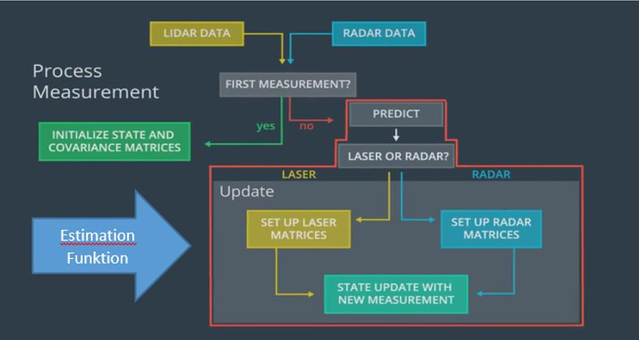

	
## In the prediction state (for Radar and Laser Measurements):

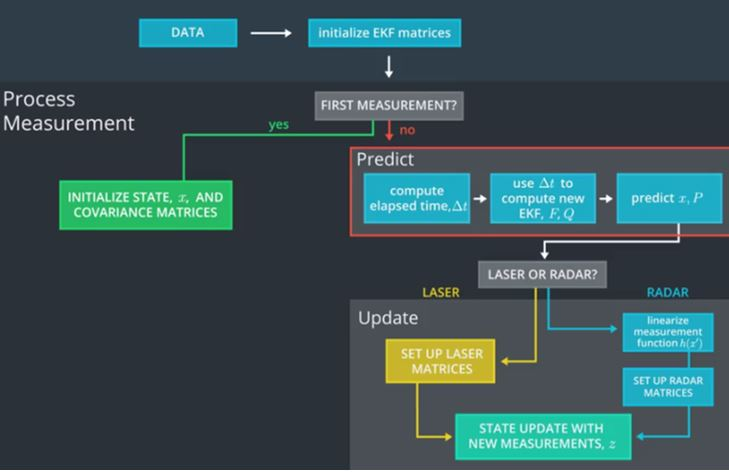
	
*	We predict the pedestrian’s state by taking to account the elapsed time between the current and the pervious observations, because in the reality the time elapsed between two consecutive observations might vary and is not constant.

	1.	We can use the timestamp values to compute the elapsed time 
		 between two consecutive observations and additionally
		 we divide the result by 10^6 to transform it from microseconds to seconds
		 

		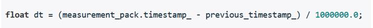
		

	2.	Linear Motion Model, we can predict the next state with help of the old positions plus 			displacement times Δt and plus noise, which has the mean zero.
		

		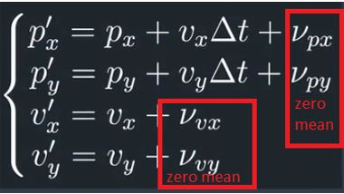
		

	3.	F: is a transition matrix that, when multiplied with x, predicts where the object will be 		after time Δt.
		

		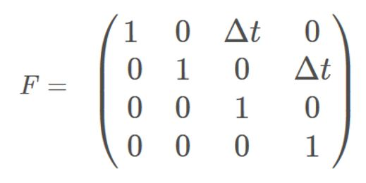
		

	4.	ν: We assume the object travels at a constant velocity, but in reality, the object might accelerate or decelerate. The notation ν∼N(0,Q) defines the process noise as a Gaussian distribution with mean zero and covariance Q. (The mean = 0 is saying that the mean noise is zero and the uncertainty shows up in the Q matrix as acceleration noise).
	5.	Q: Motion noise and process noise refer to the same case: uncertainty in the object's position when predicting location. The model assumes velocity is constant between time intervals, but in reality, we know that an object's velocity can change due to acceleration. The model includes this uncertainty via the process noise, which explained in the section (ν). The process noise depends on two things: the elapsed time and the uncertainty of acceleration. We can model the process noise by considering both of these factors.
			
		First I am going to show how the acceleration is expressed by the kinematic equation then I use that information to drive the process covariance Q (ν∼N(0,Q)).

		Say we have two consecutive observation of the same pedestrian with initial and final velocities then we can drive from the kinematic formula the change in the velocity, in other word including acceleration:		
	

	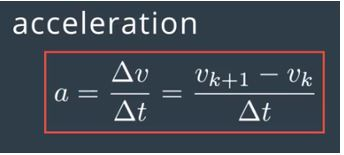
	

		
	Since the acceleration is unknown, we can add it to the last component (stochastic part) and acceleration is a random vector with zero mean and standard deviation sigma ax and sigma ay.
	
	

	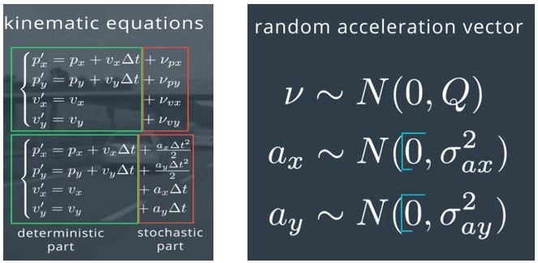
	

		
	The below presented vector can be decomposed into two components:

		A four by two matrix G  which doesn’t contain random components
		A two by one matrix contains random acceleration components
			
	

	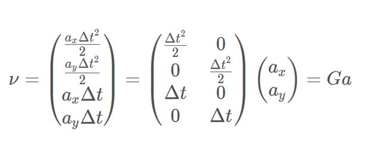
	

	
	Based on our noise vector we can define now the new covariance matrix Q. The covariance matrix is defined as the expectation value of the noise vector ν times the noise vector νT:
	

	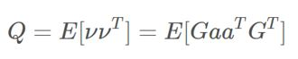
	

	
	As G does not contain random variables, we can put it outside the expectation calculation.
	

	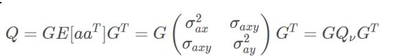
	

		
	This leaves us with three statistical moments: 
		
	

	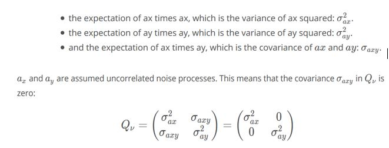
	

	
	After combining everything in one matrix, we obtain our 4 by 4 Q matrix:
	

	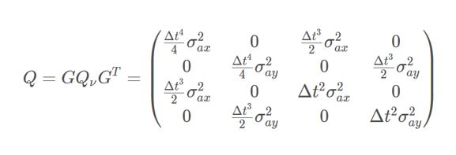
	

		
	5.	B: is a matrix called the control input matrix and u is the control vector. We will assume that there is no way to measure or know the exact acceleration of a tracked object. For example, if we were in an autonomous vehicle tracking a bicycle, pedestrian or another car, we would not be able to model the internal forces of the other object; hence, we do not know for certain what the other object's acceleration is. Instead, we will set Bu=0 and represent acceleration as a random noise with mean ν.
		
	6.	x′: The x′=Fx+Bu+ν equation does these prediction calculations for us but then Bu was crossed out leaving x′=Fx+ν. The noise mean = 0 is saying that the mean noise is zero. The equation then becomes x′=F∗x.o	x′: The x′=Fx+Bu+ν equation does these prediction calculations for us but then Bu was crossed out leaving x′=Fx+ν. The noise mean = 0 is saying that the mean noise is zero. The equation then becomes x′=F∗x.
	

	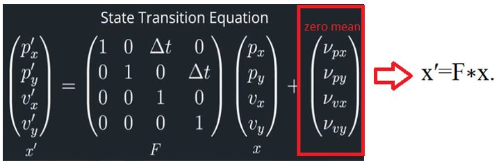
	

		
	7.	P′=FPFT +Q represents this increase in uncertainty.
	

## In The measurement update

Uses new observations to correct our belief about the state of the predictions and depends on sensor type (Lidar and Radar). If a laser sensor generates the current measurement, we just apply a standard kalman filter to update the pedestrian state and why radar measurements involves a non-linear measurement function when we receive a radar measurement, we use the extended kalman filter to measurement update.

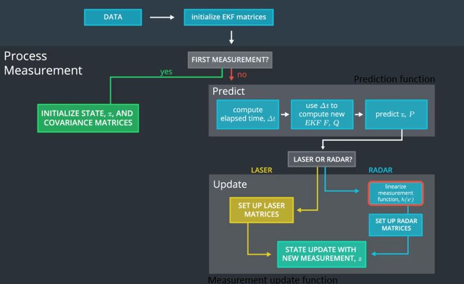

	
Notice: the state of the pedestrian’s position and velocity is updated asynchronously each time the measurement received regardless of the source sensor.
	
## 	Update Step for Laser Measurement:

1.	H (state transition matrix) we use the measurement function to map the state vector into the measurement space of the sensor. To give a concrete example, lidar only measures an object's position (px, py) but the extended Kalman filter models an object's position and velocity. So multiplying by the measurement function H matrix will drop the velocity information from the state vector x.

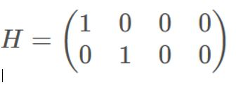

2.	w: represents sensor measurement noise. Measurement noise refers to uncertainty in sensor measurements. The notation ω∼N(0,R) defines the measurement noise as a Gaussian distribution with mean zero and covariance R. Measurement noise comes from uncertainty in sensor measurements.

3.	z=H∗x+w for the update step (Measurement Function which is a linear function). We use the measurement function to map the state vector into the measurement space of the sensor. To give a concrete example, LIDAR only measures an object's position but the extended Kalman filter models an object's position and velocity. So multiplying by the measurement function H matrix will drop the velocity information from the state vector x. Then the lidar measurement position and our belief about the object's position can be compared. 

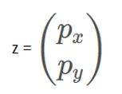

	
4.	R, which represents the uncertainty in our sensor measurements. The dimensions of the R matrix is square and each side of its matrix is the same length as the number of measurements parameters z. The matrix R represents the uncertainty in the position measurements we receive from the laser sensor and generally, the parameters for the random noise measurement matrix will be provided by the sensor manufacturer.

5.	y=z−Hx′: Now we get some sensor information (z) that tells where the object is relative to the car. First we compare where we think we are with what the sensor data tells us y=z−Hx′.

6.	The K matrix, often called the Kalman filter gain, combines the uncertainty of where we think we are P′ with the uncertainty of our sensor measurement R. If our sensor measurements are very uncertain (R is high relative to P'), then the Kalman filter will give more weight to where we think we are: x′. If where we think is uncertain (P' is high relative to R), the Kalman filter will put more weight on the sensor measurement: z.

7.	I is identity matrix.

8.	The Kalman Filter update Formula for Laser Measurements:

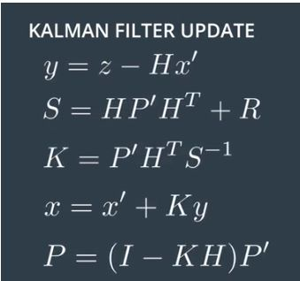

	
##	 Update Step for Radar Measurements:

Radar sees the world differently, as you can see in the photo our vehicle is at A coordinate and the pedestrian at B coordinate. The x-axis is always points in the vehicle’s direction of movement and the y-axis is always points to the left. Instead of 2D, the Radar can directly measure:

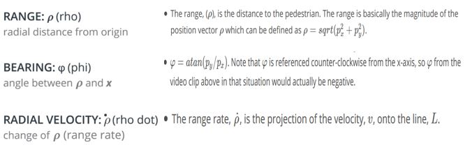

	
Using Doppler effects the Radar can directly measure the radial velocity of a moving object and the radial velocity is the component (ρ˙) of the velocity moving towards or away from the sensor. 

1.	z: Measurement vector is 3-measurement vector component:

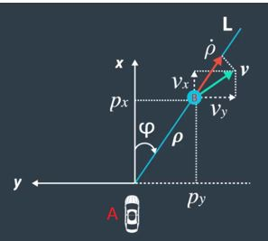

	
2.	R: Radar measurement Covariance becomes a 3by 3 diagonal matrix (considering that the tree measurement vector component are not cross-correlated).

	
3.	y=z−h(x′): Our state (x′) from the prediction step still has four parameter as the same and as before said the measurement vector has 3 parameters, in order to calculate y=z−h(x′) we need a measurement function that maps the predicted state(x′) into measurement space:

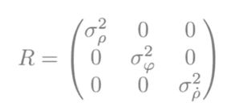

	
The h is nonlinear function that specifies how the predicted position and speed get mapped to the polar coordinates of range, bearing and range rate and h function is presented below:

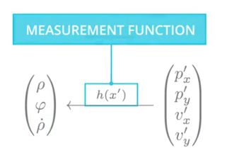

	
Notice: One other important point when calculating y with radar sensor data: the second value in the polar coordinate vector is the angle ϕ. You will need to make sure to normalize ϕ in the y vector so that its angle is between –π and π.

4.	Hj : After applying a nonlinear measurement function, we have 3-measurement vector component (z) which cannot be used for the Kalman Filter equations to update the predicted state (with new measurements) because we are not working with the Gaussian distribution after applying a nonlinear measurement.

To understand the problem I used a Gaussian (1) from 10,000 random values in a normal distribution with a mean of 0 then applied (2) a nonlinear function (arctan) to transform each value as you can see in 3 the resulting distribution is not any more a Gaussian distribution.

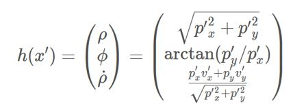

	
